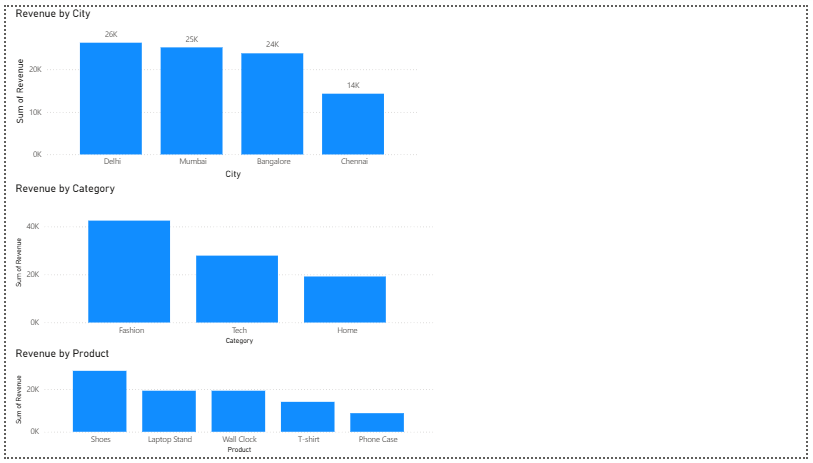

# Sales Performance Dashboard

## Dashboard Preview

D
## Objective
The goal of this project is to analyze sales data and identify key revenue drivers across cities, product categories, and individual products.

## Tools Used
- Excel (data preparation)
- MySQL (data querying)
- Power BI (data visualization)

## Dataset
The dataset contains sales transactions with the following fields:
- Order_ID
- Date
- City
- Product
- Category
- Quantity
- Price
- Revenue

## Key Analysis Performed
- Revenue analysis by city
- Revenue analysis by category
- Top-performing products by revenue

## Key Insights
- Delhi and Mumbai are the highest revenue-generating cities
- Fashion category contributes the most to overall sales
- Shoes are the top-performing product

## Project Structure
- data/ → raw dataset (CSV)
- sql/ → SQL queries used for analysis
- dashboard/ → Power BI dashboard file

## Conclusion
This project demonstrates how raw sales data can be transformed into actionable insights using SQL and Power BI.
